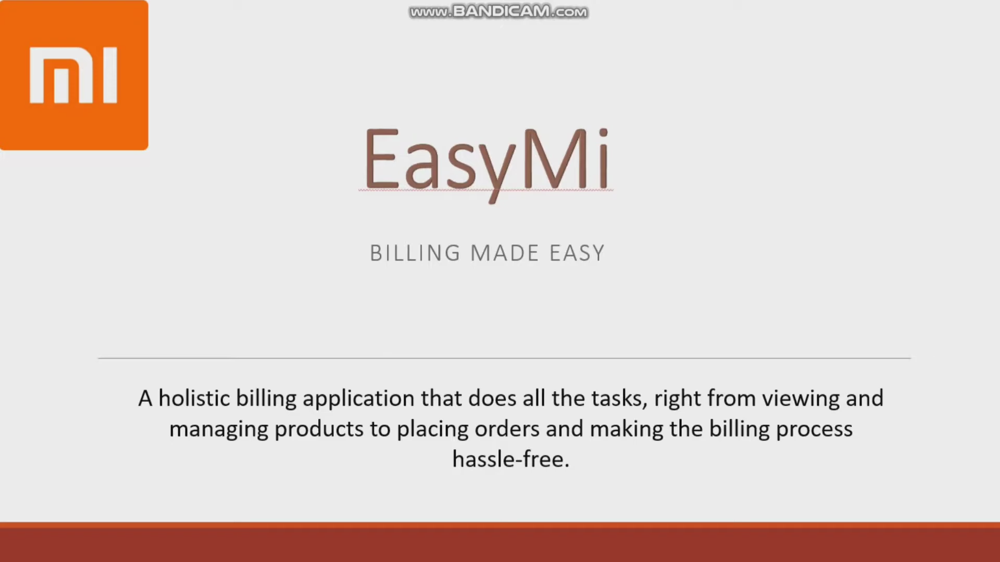
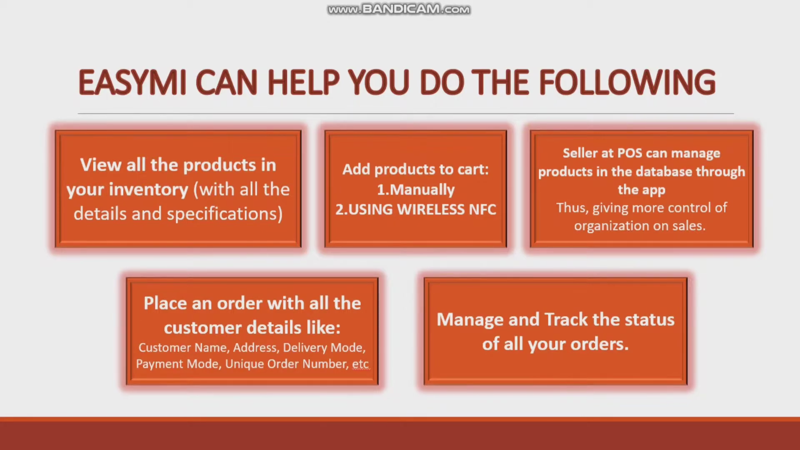

# EasyMi

A Xiaomi Store that enables user to access store features in a fast and efficient manner.
[.apk link](https://drive.google.com/file/d/1-MkSpbs-CtE6CBUOC1gnIb0WyinYzM5Z/view?usp=sharing)

## Features

NFC tags mapped to specific products.
Very simple to use UI with no banners and new launches.
Item count shown on cart in the form of batch.
Person in charge at POS may add his/her own products in the database through the app, giving more control of organization on sales.

## About Project

## Tutorial

Req. NFC enabled phone, NFC tag/phone

- Install the file on an android system which supports NFC (Please ignore the warning as the app is pre-tested and is completely safe to use.).
- Login with the following credentials or make a new account:
  MI Id-test@mail.com
  Pass- 12345678
- Explore the store and test regular store features.
  Special emphasis: Cart section to enter customer information and Orders screen wherein all customer order can be seen by salesperson.
- If grey, click the box on the top to enter NFC settings and hit back.(If still grey, press on the box again).
- Yellow box indicates successful setup of NFC, bring another NFC enabled phone or NFC tag to test.
- If the box turns green, the tag was detected, click on the box.
- A product pops up symbolising that NFC tag mapped to that product in a production scenario.

## Special Features:

- (NFC tags mapped to specific products) With appropriate NFC tags installed all around the store.
- Very simple to use UI with no banners and new launches.
- Item count shown on cart in the form of batch.
- Cart System
- Investment is minimal in terms of setup and cost.
- User friendly experience with little to no technical know-how.
- Person in charge at POS may add his/her own products in the database through the app, giving more control of organization on sales.

Presenting to you EasyMi: A holistic billing application that does all the tasks, right from viewing and managing products to placing orders.
Reduces the effort of both the customer and the seller by using an NFC tag that enables the customer to see all the information of a product and order it just by a tap.

## Future Scope:

- Categorize products
- Payment Gateway
- Autofill customer details from db
